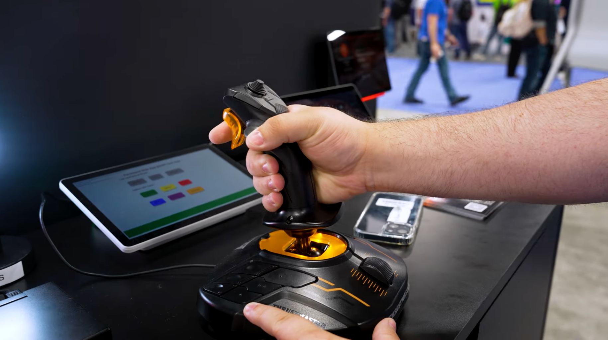
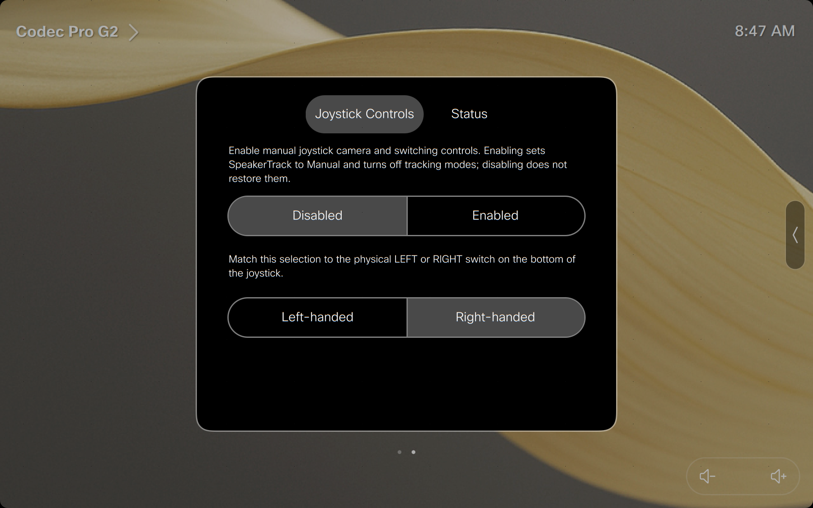
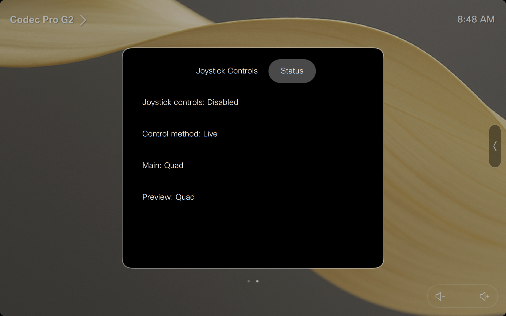

# Joystick Camera Control Production Switcher



_The joystick camera-control experience demonstrated at InfoComm 2026._

Control Cisco RoomOS cameras with a Thrustmaster T.16000M joystick and run a simple Main/Preview production workflow without a separate control computer. This solution is purpose-built for the **Thrustmaster T.16000M** and its specific buttons, axes, and left/right-handed hardware modes; it is not a generic USB-joystick integration.

## Start with the Web Installer

### [Open the hosted Web Installer →](https://ctg-tme.github.io/Joystick_CameraControl_ProductionSwitcher_using_Thrustmaster_16000M/)

The guided Web Installer is the fastest way to configure one to four cameras, assign every T.16000M button, install or update both required RoomOS macros, and download a room-specific PDF operator guide. You can start fresh, upload an existing macro, or fetch the installed configuration from a verified device.

For device checks, security behavior, and deployment details, see [Web Installer configuration and installation](docs/web-tool-installation.md). A complete [manual configuration](#configure-the-solution-macro-manually) and [manual installation](#install-the-macros-manually) path is also available below.

## What this solution offers

- **Direct camera control** — pan, tilt, and zoom a Cisco camera from a Thrustmaster T.16000M connected directly to the RoomOS device over USB.
- **Production switching** — send a camera directly to **Main** (live) or stage it on **Preview** before swapping it to Main.
- **Up to four camera sources** — give each camera a readable name and a dedicated selection button.
- **Custom RoomOS controls** — enable or disable joystick operation, match the joystick's handedness switch, and check the live operating state from the touch controller.
- **Configurable button actions** — assign camera selection, Main/Preview control, source swapping, Precision Mode, and selfview actions to the 16 physical buttons.
- **Operator safeguards** — joystick control starts disabled, automatic tracking is suspended before manual control begins, and unexpected SpeakerTrack activation produces an on-screen warning.
- **Printable room guide** — the Web Installer can generate a one-page operator guide for the room's exact configuration.
- **A foundation to extend** — fork the project to add room-specific actions, production workflows, UI, or integrations.

In this project, **Main** is the camera source currently live to the audience. **Preview** is the camera staged on a dedicated local display. The **Controlled Camera** is the physical camera that responds to joystick movement; it can currently occupy either role.

## How an operator uses it

1. Open the **Joystick Controls** panel on the RoomOS touch controller.
2. Match **Left-handed** or **Right-handed** to the physical switch on the bottom of the joystick.
3. Select **Enabled**. If configured, the default camera is placed on Main.
4. Choose whether the joystick should control the camera on **Main** or **Preview**.
5. Press a configured camera button to place that camera in the selected role and take control of it.
6. Pan, tilt, and zoom the camera. Hold **Precision Mode** when a slower movement is needed for fine framing.
7. If Preview is enabled, use **Swap** to exchange Main and Preview. Joystick control follows the same physical camera into its new role.

Select **Disabled** when finished. Disabling stops joystick input and clears the Preview matrix output, but it does not change Main or restore camera-tracking modes. Closing the panel by itself does not disable the joystick.

## Feature breakdown

### Custom RoomOS interface

The macro installs and maintains its own **Joystick Controls** panel. The controls page provides the two operator settings that must be immediately accessible in the room:

- **Joystick controls** — starts `Disabled`; select `Enabled` to accept joystick input.
- **Handedness** — matches the left/right switch on the underside of the joystick and immediately remaps the base buttons.



Enabling joystick control sets SpeakerTrack behavior to Manual and attempts to deactivate SpeakerTrack, Closeup, Frames, and PresenterTrack before accepting input. Unsupported tracking commands are logged as warnings and do not block joystick operation. Disabling the joystick does not restore the previous tracking state; use the normal Camera Control interface to re-enable tracking.

### Live status

The panel's **Status** page gives the operator an at-a-glance view of:

- whether joystick controls are enabled;
- the current control method: `Live` for Main or `Preview` for the staged source;
- the camera currently assigned to Main;
- the camera currently assigned to Preview, or `Disabled` when Preview is off.



### Joystick movement

The three camera-motion controls are fixed:

| Physical control | Camera operation |
|---|---|
| Main stick forward/back | Tilt |
| Main stick twist | Pan |
| Hat/mini-stick up/down | Zoom |

The main stick's left/right roll and the base throttle slider are not used. Camera movement stops when the active control returns to center, the Controlled Camera changes, handedness changes, or joystick control is disabled.

### Available button actions

Every physical button can be assigned one of these actions in `config.controls`:

| Button action | Operator result |
|---|---|
| `PrecisionMode` | Reduces pan, tilt, and zoom speed while the button is held. |
| `SwapMainPreview` | Exchanges Main and Preview while control follows the same physical camera into its new role. |
| `ControlMain` | Makes the camera on Main the Controlled Camera; the Status page reports `Live`. |
| `ControlPreview` | Makes the staged Preview camera the Controlled Camera. |
| `SelfviewWindowed` | Shows selfview as an inset on the first monitor. |
| `SelfviewFullscreen` | Shows fullscreen selfview on the first monitor. |
| `SelfviewOff` | Hides selfview. |
| A camera action such as `SelectCamera1` | Places that camera on the currently controlled role and transfers joystick control to it. |
| `''`, `null`, or `undefined` | No Action. |

Preview actions safely do nothing when `config.previewDisplay.mode` is `Off`.

### Default button layout

Guide numbers are stable physical references. The left/right logical IDs account for the handedness switch; the action remains at the same physical guide-button position.

| Guide button | Physical control | Right-handed logical ID | Left-handed logical ID | Default action |
|---:|---|---|---|---|
| 1 | Trigger | `STICK_TRIGGER` | `STICK_TRIGGER` | Precision Mode |
| 2 | Lower center stick button | `STICK_SOUTH` | `STICK_SOUTH` | No Action |
| 3 | Left stick-side button | `STICK_EAST` | `STICK_EAST` | Swap Main/Preview |
| 4 | Right stick-side button | `STICK_WEST` | `STICK_WEST` | Swap Main/Preview |
| 5 | Left base top button | `BASE_LEFT_1` | `BASE_RIGHT_3` | Control Main |
| 6 | Left base upper-middle button | `BASE_LEFT_2` | `BASE_RIGHT_2` | Selfview windowed |
| 7 | Left base middle button | `BASE_LEFT_3` | `BASE_RIGHT_1` | Selfview fullscreen |
| 8 | Left base lower button | `BASE_LEFT_6` | `BASE_RIGHT_4` | No Action |
| 9 | Left base lower-middle button | `BASE_LEFT_5` | `BASE_RIGHT_5` | Selfview off |
| 10 | Left base inner button | `BASE_LEFT_4` | `BASE_RIGHT_6` | Control Preview |
| 11 | Right base top button | `BASE_RIGHT_3` | `BASE_LEFT_1` | Select Camera 2 |
| 12 | Right base upper-middle button | `BASE_RIGHT_2` | `BASE_LEFT_2` | Select Camera 1 |
| 13 | Right base inner-top button | `BASE_RIGHT_1` | `BASE_LEFT_3` | No Action |
| 14 | Right base inner-lower button | `BASE_RIGHT_4` | `BASE_LEFT_6` | No Action |
| 15 | Right base lower-middle button | `BASE_RIGHT_5` | `BASE_LEFT_5` | Select Camera 3 |
| 16 | Right base lower button | `BASE_RIGHT_6` | `BASE_LEFT_4` | Select Camera 4 |

The original numbered control reference is available in [Guides/thrustmaster16000m-camera-guide.html](Guides/thrustmaster16000m-camera-guide.html).

## Requirements and limitations

- A Cisco codec or collaboration device running a RoomOS release that supports the InputDevice Joystick API.
- RoomOS administrator access and access to the Macro Editor.
- A Thrustmaster T.16000M USB joystick connected to a supported USB port on the device.
- One to four camera video inputs.
- Cisco certified cameras for joystick pan, tilt, and zoom control.
- A free display output when using Preview. Preview is not recommended when three displays are already active.

USB and uncertified cameras may still be available as switchable video sources, but this solution does not provide joystick PTZ control for them. Additional integration or macro development is required.

Resources:

- [Thrustmaster T.16000M documentation](https://support.thrustmaster.com/en/product/t16000mfcs-en/)
- [T.16000M InputDevice class](https://github.com/ctg-tme/Thrustmaster_16000M-InputDevice-Class)

## Configure the solution macro manually

Open [Joystick_CameraControl_ProductionSwitcher.js](Joystick_CameraControl_ProductionSwitcher.js) in a text editor and find the `config` object between the `JOYSTICK_CONFIG_START` and `JOYSTICK_CONFIG_END` markers. Only edit the configuration inside those markers.

### Identify each camera

For every source, collect:

- a short operator-facing camera name;
- the RoomOS video input `ConnectorId` used to put the source on Main or Preview;
- the RoomOS camera `ControlId` that receives pan, tilt, and zoom commands.

`ConnectorId` and `ControlId` are different identifiers even when they happen to use the same number.

### Configuration reference

| Configuration property | What to enter |
|---|---|
| `config.documentation.ProjectName` | Optional project name included in generated documentation. |
| `config.documentation.RoomName` | Optional room name included in generated documentation. |
| `config.previewDisplay.mode` | `'On'` to stage sources on a Preview display or `'Off'` for Main-only operation. |
| `config.previewDisplay.output` | Positive whole-number matrix output reserved for Preview. It is still required when Preview is off. |
| `config.userInterface.panelLocation` | `'HomeScreen'`, `'CallControls'`, `'HomeScreenAndCallControls'`, or `'ControlPanel'`. |
| `config.joystick.StartingHand` | `'left'` or `'right'`; match the switch on the bottom of the joystick. |
| `config.joystick.SetDefaultCamera` | `true` to put the default camera on Main when controls are enabled; `false` to leave the existing Main source unchanged. |
| `config.joystick.DefaultCameraAction` | The `ButtonAction` of the default camera, such as `'SelectCamera1'`. |
| `config.joystick.Camera.PanTiltRampSpeed` | Whole number from `1` to `24`. |
| `config.joystick.Camera.ZoomRampSpeed` | Whole number from `1` to `15`. |
| `config.joystick.Camera.SlowModeDivisor` | Number greater than `0`; Precision Mode divides both movement speeds by this value. |

Keep the default `InstallerUrl` and `RepositoryUrl` unless the project is hosted somewhere else. The macro uses `InstallerUrl` to retrieve the custom panel icon and retains the standard Sliders icon if that download fails.

### Define one to four cameras

Each camera needs a unique, readable `ButtonAction`:

```js
cameras: [
  {
    ButtonAction: 'SelectCamera1',
    Name: 'Presenter',
    ConnectorId: '1',
    ControlId: '1'
  },
  {
    ButtonAction: 'SelectCamera2',
    Name: 'Audience',
    ConnectorId: '2',
    ControlId: '2'
  }
]
```

The array must contain between one and four cameras. Every camera action must be unique and assigned to exactly one physical button.

### Assign all 16 buttons

Edit the values in `config.controls` using the actions listed above. Keep every logical ID in the object, even when its value is blank. Use `''` for a button with No Action.

The supplied defaults are authored for `StartingHand: 'right'`. If the room should start left-handed, move each base-button action to the corresponding **Left-handed logical ID** in the default-layout table; changing `StartingHand` alone does not rewrite the configuration. Later handedness changes made from the RoomOS panel preserve these configured physical positions automatically.

If you remove a camera, also remove its old `SelectCamera...` assignment from `config.controls`. Confirm that:

- every configured camera action appears exactly once;
- `DefaultCameraAction` points to one of those cameras;
- every non-blank value is a built-in action or a configured camera action;
- Preview-only actions are blanked when they would confuse operators in a Main-only room.

The macro validates this configuration at startup and reports a clear initialization error for missing, duplicated, or unknown values.

## Install the macros manually

Use this path when you prefer direct control of the macro source or cannot use the Web Installer.

1. Download this repository's [solution macro](Joystick_CameraControl_ProductionSwitcher.js).
2. Download [`Thrustmaster_16000M-Class.js`](https://github.com/ctg-tme/Thrustmaster_16000M-InputDevice-Class/blob/main/Thrustmaster_16000M-Class.js) from the separate InputDevice class project.
3. Complete the configuration steps above before importing the solution macro, or edit the same configuration block in the RoomOS Macro Editor.
4. Connect the T.16000M to the RoomOS device and set the physical switch on its underside to the configured handedness.
5. Sign in to the device web interface and open the **Macro Editor**.
6. Import the dependency and save it with the exact macro name `Thrustmaster_16000M-Class`. It can remain inactive because the solution imports it as a module.
7. Import `Joystick_CameraControl_ProductionSwitcher.js`, then save and activate it.
8. Restart the macro runtime. **This restarts every active macro on the device**, so perform this step during an appropriate maintenance window.
9. Open **Joystick Controls** on the touch controller, confirm the handedness, and select **Enabled**.
10. Open **Status** and verify the expected Main camera, Preview camera, and control method before operating the room.

The solution macro automatically enables RoomOS joystick input and installs or updates its touch-panel UI each time it starts. Look for `Joystick Ready with Pan/Tilt/Zoom` in the macro logs to confirm successful initialization.

## Web Installer details

The browser configurator can discover an installed configuration, guide button assignments, install or update both macros, and generate a configuration-specific PDF operator guide. Its device workflow restarts the RoomOS macro runtime, so review the advanced deployment details before connecting to a production device.

See [Web Installer configuration and installation](docs/web-tool-installation.md) for device checks, security behavior, operator-guide generation, and local development instructions.

## Fork and expand the project

This project is intended to be a practical starting point, not a closed appliance. [Fork the repository](https://github.com/ctg-tme/Joystick_CameraControl_ProductionSwitcher_using_Thrustmaster_16000M/fork) and adapt it to the production needs of your rooms.

Possible extensions include:

- new `ButtonAction` handlers for room controls or production tasks;
- additional switching workflows and external video-system integrations;
- alternate status pages and operator-facing RoomOS controls;
- site-specific camera presets, layouts, and automation;
- support for other input hardware through a purpose-built InputDevice class and mapping layer.

Keep hardware-specific input handling separate from the production-switcher behavior so a new controller can be added without weakening the T.16000M experience. Reusable fixes and extensions are welcome as upstream contributions.

## Project contents

| Path | Purpose |
|---|---|
| [Joystick_CameraControl_ProductionSwitcher.js](Joystick_CameraControl_ProductionSwitcher.js) | The configurable RoomOS solution macro and self-installed Joystick Controls panel. |
| [docs/web-tool-installation.md](docs/web-tool-installation.md) | Advanced Web Installer configuration, installation, and update workflow. |
| [installer/](installer/) | Source for the hosted Web Installer. |
| [output/pdf/Joystick_CameraControl_User_Manual.pdf](output/pdf/Joystick_CameraControl_User_Manual.pdf) | Representative generated operator guide. |
| [Guides/thrustmaster16000m-camera-guide.html](Guides/thrustmaster16000m-camera-guide.html) | Original extracted control reference. |
| [CONTEXT.md](CONTEXT.md) | Canonical operator terminology and project context. |

## Project background

This standalone implementation was isolated from the [InfoComm 2026 AVoIP Room Customization Demo](https://github.com/ctg-tme/infocomm-2026-AVoIP-RoomCustomization-Demo) without that demo's lighting, web, presentation, video-composition, standby, analytics, or HTTP-client behavior.

## License

This repository's sample code and documentation are provided under the [Cisco Sample Code License, Version 1.1](LICENSE). The vendored [Magnetic Common Design System light-theme tokens](installer/src/vendor/magnetic/README.md) are provided under their included MIT license. The external Thrustmaster class and other browser dependencies remain subject to their own licenses.
